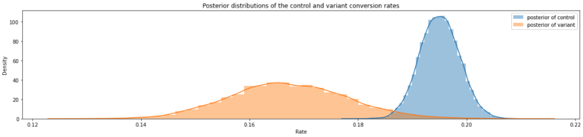
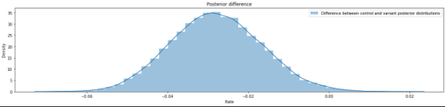
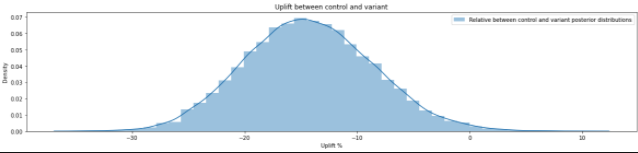
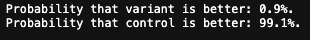

# Bayesian significance testing for ratios using beta-binomial. 

## Background

This script helps you calculate and visualize beta posterior distributions in a/b testing. It can be used to

1. Compare the posterior distributions 

2. Get posterior difference of (1). This helps you visually intepret significance by checking if the mass of this distribution is covering zero. 

3. Get the same posterior difference in uplift terms

4. Get the probabilities of the groups being better. 

**Stuff to add**

* Credible interval bands 
* Visualize mean values 

